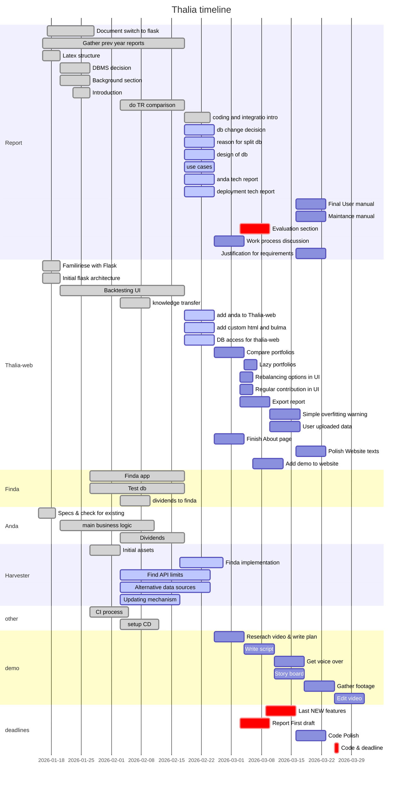

```mermaid
gantt
    title Thalia timeline
    dateFormat  MM-DD


    section Report
    Document switch to flask          :done, r1, 01-17, 11d
    Gather prev year reports 				 	:done, r2, 01-16, 33d
    Latex structure									  :done, r3, 01-16, 4d
    DBMS decision 										:done, r4, 01-20, 7d
    Background section 								:done, r5, 01-20, 7d
    Introduction 											:done, r6, 01-23, 4d
    do TR comparison									:done, r7, 02-03, 15d
    coding and integratio intro				:done, r14, 02-18, 6d
    db change decision								:active, r8, 02-18, 7d
    reason for split db								:active, r9, 02-18, 7d
    design of db											:active, r10, 02-18, 7d
    use cases													:active, r11, 02-18, 7d
		anda tech report									:active, r14, 02-18, 7d
    deployment tech report						:active, r13, 02-18, 7d
    Final User manual								  : r20, after d0, 7d
    Maintance manual								  : r21, after d0, 7d
    Evaluation section								:crit, 03-03, 7d
    Work process discussion						: r15, 02-25, 7d
    Justification for requirements 		: r16, after d0, 7d


    section Thalia-web
    Familiriese with Flask 						:done, t1, 01-16, 4d
    Initial flask architecture 				:done, t2, 01-16, 4d
    Backtesting UI 										:done, t3, 01-20, 29d
    knowledge transfer 								:done, t4, 02-03, 7d
    add anda to Thalia-web						:active, t13, 02-18, 7d
    add custom html and bulma					:active, t13, 02-18, 7d
    DB access for thalia-web					:active, t13, 02-18, 7d
    Compare portfolios								: t14, 02-25, 7d
    Lazy portfolios										: t15, after t14, 3d
    Rebalancing options in UI					: t16, 03-03, 3d
    Regular contribution in UI				: t17, 03-03, 3d
    Export report											: t18, 03-03, 7d
    Simple overfitting warning				: t19, 03-10, 7d
    User uploaded data								: t20, 03-10, 7d
    Finish About page									: t21, 02-25, 7d
    Polish Website texts							: t22, after d0, 7d
    Add demo to website								: t23, after t17, 7d


    section Finda
		Finda app 												:done, f1, 01-27, 22d
		Test db														:done, f2, 01-27, 22d
		dividends to finda								:done, f3, 02-03, 7d


    section Anda
    Specs & check for existing				:done, a1, 01-15, 4d
    main business logic								:done, a3, 01-20, 22d
    Dividends 												:done, a2, 02-03, 15d


    section Harvester
    Initial assets										:done, h0, 01-27, 7d
    Finda implementation							:active, h4, after h3, 10d
    Find API limits										:active, h1, 02-03, 21d
    Alternative data sources					:active, h2, 02-03, 21d
    Updating mechanism								:active, h3, 02-03, 14d


    section other
    CI process												:done, o1, 01-27, 9d
    setup CD													:done, o2, 02-03, 9d


    section demo
    Reserach video & write plan				: v0, 02-25, 7d
    Write script											: v1, after v0, 7d
    Get voice over										: v2, after v1, 7d
    Story board												: v3, after v1, 7d
    Gather footage 										: v4, after v3, 7d
    Edit video												: v5, after v4, 7d


    section deadlines
    Last NEW features 								:crit, d0, 03-09, 7d
    Report First draft								:crit, d3, 03-03, 7d
    Code Polish												: d2, 03-16, 7d
    Code & deadline										:crit, d1, 03-25, 1d
```

