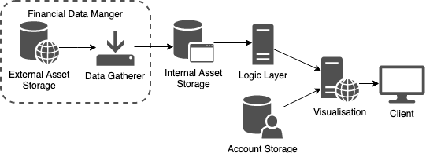
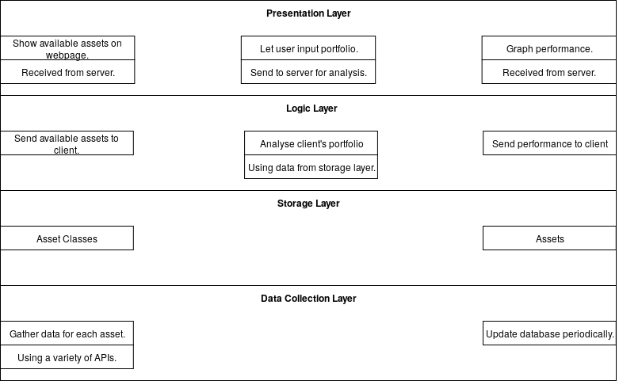
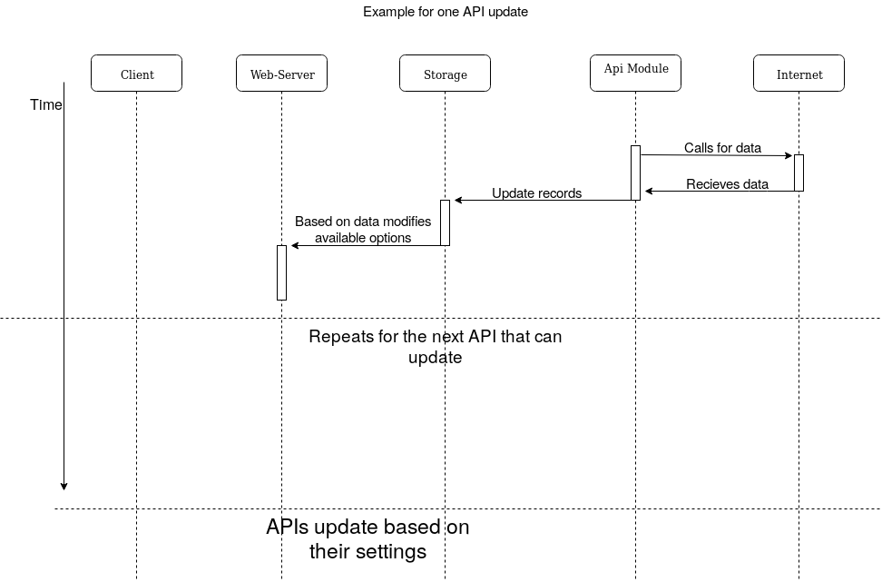
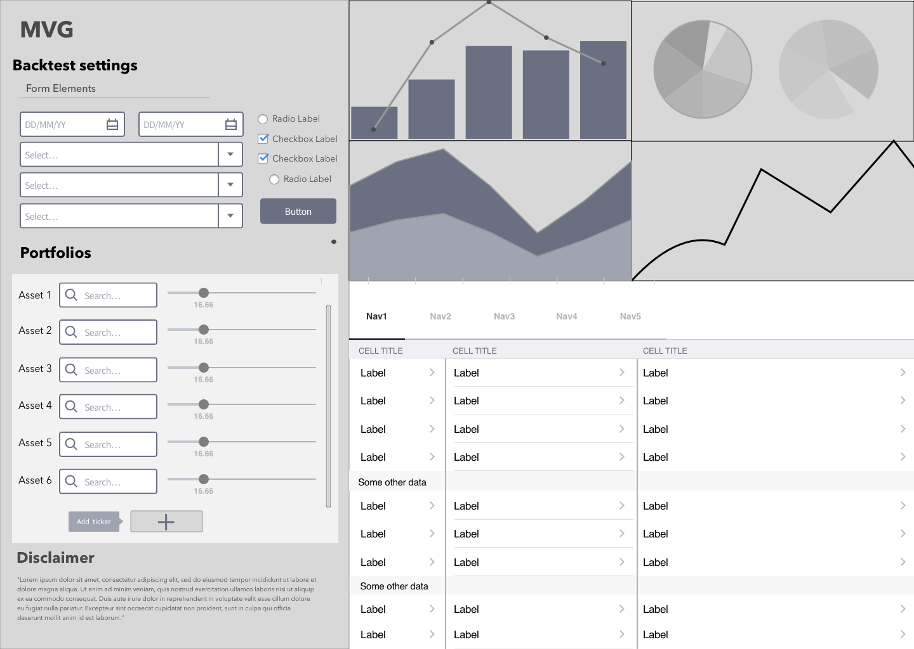
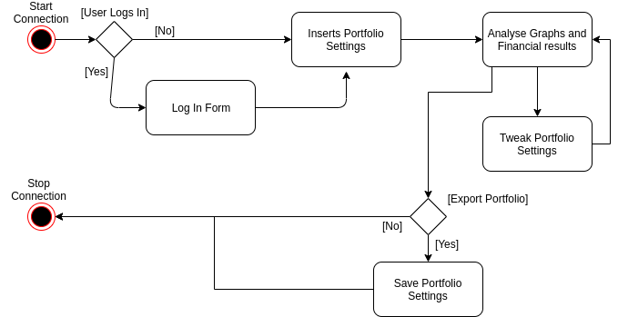
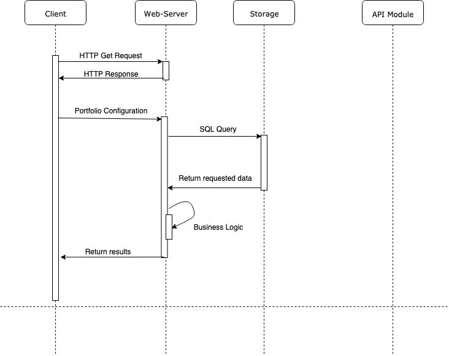

# Requirements

We classify our requirements using the established FURPS+ model. Below you will see our main functional and non-functional requirements. The items outlined below focus on some of the key requirements we have so far identified as features necessary to provide a compelling product for paying customers.

## Functional requirements

| **Create portfolio**                                              |                                                                                                                        |
| ----------------------------------------------------------------- | ---------------------------------------------------------------------------------------------------------------------- |
| Specify fixed amount/proportions of the portfolio to given assets | Choose how much each asset contributes to the portfolio's total value using either percentages or raw monetary amounts |
| Find assets quickly by category or name                           | When adding an asset the user can search a category for assets or search for a specific asset by its name              |
| Share portfolio                                                   | Portfolio's can be shared between people using a URL                                                                   |
| Edit portfolio                                                    | Change included assets and their distributions in a portfolio                                                          |

| **Setup portfolio analysis**                                     |                                                                                                                                                                                              |
| ---------------------------------------------------------------- | -------------------------------------------------------------------------------------------------------------------------------------------------------------------------------------------- |
| Compare portfolios                                               | Use multiple portfolios in a single analysis to see differences in their performance                                                                                                         |
| Compare portfolios performance against standard strategies       | Select predefined strategies to compare your (e.g. S&P 500) strategy against, such                                                                                                           |
| Use given lazy portfolios                                        | Select an existing common portfolio to compare against such as common index funds (e.g. Vanguard 500 Index Investor or SPY).                                                                 |
| Plot portfolio as a time-series                                  | View portfolio performance as a line graph for quick overview                                                                                                                                |
| Specify a time frame for the analysis                            | Select start and end dates for portfolio analysis                                                                                                                                            |
| Choose re-balancing strategy                                     | Optionally choose a strategy for buying and selling assets to meet your strategy e.g. buying and selling stocks each year to ensure the value of portfolio stays at 60% stocks and 40% bonds |
| Changes the distribution of assets in a portfolio using a slider | A slider for each asset to quickly increase or decrease it's proportion of the total value                                                                                                   |
| Edit portfolio analysis                                          | Change parameters for portfolio's analysis after running it (e.g. date range or re-balancing strategy)                                                                                       |

| **View results**                                          |                                                                                                                                                      |
| --------------------------------------------------------- | ---------------------------------------------------------------------------------------------------------------------------------------------------- |
| See key numerical figures                                 | Shows important numerical metrics for a portfolio's performance such as Initial balance, Standard deviation, Worst year, Sharpe Ratio, Sortino Ratio |
| See both real and nominal values                          | See portfolio's value as both adjusted and not adjusted for inflation                                                                                |
| A breakdown of portfolio value at specific points of time | See what the value of the portfolio is at each specified time period such as each year or month                                                      |
| Export analysis results                                   | Exports results to PDF for sharing and offline reading                                                                                               |

| **User accounts**                 |                                                                                           |
| --------------------------------- | ----------------------------------------------------------------------------------------- |
| Combine portfolios                | Combine two portfolios' assets into one single portfolio                                  |
| Save portfolio analysis for later | Save portfolio analysis parameters to the account so you can rerun it with a single click |
| Delete saved portfolio analysis   | Remove a stored portfolio analysis from your account                                      |
| Manage portfolio analyses         | Edit saved portfolio analysis with different assets, distributions or other parameters    |
| Sign-up, log in and log out       | Basic authentication                                                                      |

| **Assets**                                                                               |                                                                               |
| ---------------------------------------------------------------------------------------- | ----------------------------------------------------------------------------- |
| Choose assets from European market                                                       | Having data for European assets was found to be lacking in competing products |
| Choose assets from Equities, Fixed Income, Currencies, Commodities, and Cryptocurrencies | TBD                                                                           |

## Non-functional requirements

- Usability
  
  - The product must be easily usable for users who already have some financial investment experience.
  
  - Basic backtesting interface needs to look familiar to people already experienced with backtesting.
  
  - The product will have detailed instructions on how to use its advertised functions.
  
  - All major functions must be visible from the initial landing page.
  
  - Must work in both desktop and mobile browsers.
  
  - The results page should scale with mobile.

- Reliability
  
  - The product must have a greater than 99% uptime.
  
  - All our assets need to have up to date daily data where the asset is still publicly tradeable.
  
  - All assets supported by the system must provide all publicly available historical data.

- Performance
  
  - The website should load within 3 seconds on mobile [Google Data, Global, n=3,700 aggregated, anonymized Google Analytics data from a sample of mWeb sites opted into sharing benchmark data, March 2016.].
  
  - Large portfolios must be supported - up to 300 different assets.

- Implementations
  
  - The system needs to work on a cloud hosting provider.

- Interfacing
  
  - The data gathering module must never use APIs stated to-be-deprecated within a month.
  
  - The data gathering module must not exceed it's contractual usage limits.

- Operations
  
  - An administrator on call will be necessary for unexpected issues.

- Packaging
  
  - The product needs to work inside a Linux container (e.g. Docker).

- All dependencies need to be installable with a single command.

- Legal
  
  - All user testing must be done with ethical approval from the University.
  
  - UI must display a clear legal disclaimer about the service not providing financial advice.
  
  - All third-party code should allow for commercial use without requiring source disclosure (e.g. no GPL-3).
  
  - User data handling should comply with GDPR.

# Architecture Choice

We started by looking at the main architecture types and checking their

advantages and disadvantages in case of our application. All of this was done while keeping in mind that we are developing a web application. This has helped us greatly reduce the numner of candidate architectures. The remaining ones specific to web developement were *Client-Server*, *Data Centric* and the *Layered* types. Out of those the options that proved to be the most advantageous were the *Hexagonal* and the *Three Layer* architectures. However due to the fact that the key

point of our application is data collection and processing, it was

decided that steps should be taken in order to isolate the financial

data management. As a result doing this we have modified our *Hexagonal* architecture to include a marginal *Financial Data Manager*. For the *Three Layer* architecture we have added a extra layer below the data storage layer. After comparing the two we have decided that the modified *Three Layer* had a more clear representation of our application.

## References

At the base of our choices we had the adive given in (*0) IEEE Software 2006 Vol. 23 Issue No. 02 -March/April. Particularly *Software Architecture-Centric Methods and Agile Development*

# Architecture Diagram

# Reasoning for making a Financial Data Retrieval layer

The first argument comes from the need of extra Security. While the

data we have can be found for free in small quantities, getting it from

multiple sources and storing it all in one place make it have financial

value. In addition this is a good way to make sure that we have a clear-cut control procedures over our data. By giving the web-server limited

permissions to the to the financial data, we limit the type of attacks

that can take place. In addition, by not including the financial data

retrieval in the business logic core allows for added availability since

the web-sever and the data retrieval can work independently and can be

modified independently. In addition the calls to the financial

application programming interfaces require private keys that we want to

keep in a more secure manner than having the web server have access to

them.

An additional argument would clean data flow provided by this architecture.

## References

For the above our main references are the guide lines provided by the National Cyber Security Centre for Separation and cloud security.

https://www.ncsc.gov.uk/guidance/separation-and-cloud-security

# Layer View of the Architecture

# Portfolio Data Representation

We have chosen to create two separate data types for a portfolio - one

for its specification (how much to invest in what) and one for its

performance (how much money one has at a given moment in time). The

client constructs the specification based on user input and sends it to

the server. Once received, the server does the necessary computations

and sends back the portfolio performance to the client.

Benefits:

- The client does not need to have a high-end CPU to get their

information quickly.

- Minimal information is passed over networks, which can be slow and

unreliable.

Drawbacks:

- The response time might be increased when doing intensive numerical calculations for multiple clients.

# Data Harvester

It connects to a series of financial application programming interfaces

and continuously updates the data based on the restrictions imposed by

each application programming interface. The module is connected to the database and does some light parsing on the data it receives. It standardizes the collected data so that it can be saved in a SQL database. The standardization can be done in two ways. If the interface allows than the data is pulled in a pandas data frame, then it is cleaned from unecessary infromation, converted to csv and passed to the database. Otherwise it is parsed as simple text, the data not used will be cleaned, the text will be placed in a csv format and passed to the database.

# Time events Diagram for Data Harvester

# Data usage Legalities

We have consulted the Terms and Conditions for the data we use. After conducting this reasearch we have observed that for the APIs we are using no legal problems could arise. The companies providing the data have full control over what data they are releasing because of that everybody is compling with their requirements automatically.

# Framework

We have used the django framework without the ORM, in order to have

complete control over our data processing. This decision was made

because we prefer a batteries-included approach to web-application making

while we prefer a bare-metal full control type of approach to data

management.

# Frontend

The attached wire frame will display the base of how the main page will look like. This wireframe model will be implemented using bootstrap like libraries in order to speed up the process. The base of our frontend will be composed of HTML5, CSS and JavaScript. For CSS we have decided to not use pre-processors since it does not provide any substantial advantage. In the case of JavaScript we will use plotting libraries such as plot.ly in order to get attractive graphs.

# Activity Diagram (Non-Technical Aspects)

The following diagram contains a typical user interaction with our website.

## References

https://glossarytech.com/terms/front_end-technologies

https://www.credencys.com/blog/front-end-technologies/

https://www.quora.com/What-is-front-end-technologies

https://www.valuecoders.com/blog/technology-and-apps/top-15-front-end-development-tools-2019/

# Inter Layer Comunications

Our Inter layer comunications have been based on the principles of *Separation of Concerns*. Going on this idea we have made sure that at each step each layer knows only as much is it needs. The style and presentation is sent to the client machine and then only the client has interactions with it. The Buisness Logic has been placed as a separate module on the web-server and it only has read writes to the financial data on the database. The logic of the Data Harvester is outside of the Django Web-Server and it does not have any connection with any of the website components other than the write acces to the database.

## References

https://medium.com/machine-words/separation-of-concerns-1d735b703a60

# User interaction process Diagram (Technical Aspects)

## Bibleography

(*0) IEEE Software 2006 Vol. 23 Issue No. 02 -March/April. Particularly *Software Architecture-Centric Methods and Agile Development*

(1*)https://www.itopstimes.com/cloud/10-use-cases-for-serverless/

(2*)https://www.ncsc.gov.uk/guidance/separation-and-cloud-security
