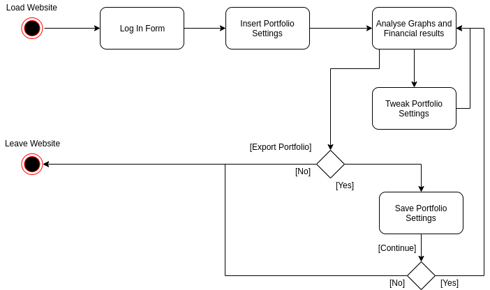

# Introduction

This report will present our findings and progess over the course of the semester. 

First, we will describe both the functional and non-functional requirements. We then move on to discussing the System Architecture. Next, we present the risks we have identified as non-negligible and the strategies we have developed for mitigating them. This will be followed by our Initial Project Plan, which defines our approach to creating the product and specifies a schedule for development. Finally, we will discuss problems we have encountered and the solutions we have found in trying to solve them.

# Requirements

We classify our requirements using the established FURPS+ model [1]. Below you will see our main functional and non-functional requirements. The items outlined below focus on some of the key requirements we have so far identified as features necessary to provide a compelling product for paying customers.

## Functional requirements

| **Portfolio Configuration**                                        |                                                                                                                         |
| ------------------------------------------------------------------ | ----------------------------------------------------------------------------------------------------------------------- |
| Allocate fixed amount/proportions of the portfolio to given assets | Choose how much each asset contributes to the portfolio's total value using either percentages or raw monetary amounts. |
| Find assets quickly by category or name                            | When adding an asset the user can search a category for assets or search for a specific asset by its name               |
| Share portfolio                                                    | Portfolios can be shared between people using a URL                                                                     |
| Edit portfolio                                                     | Change asset allocation and their distributions in a portfolio                                                          |

| **Setup portfolio analysis**                                     |                                                                                                                                                                                                                                     |
| ---------------------------------------------------------------- |:----------------------------------------------------------------------------------------------------------------------------------------------------------------------------------------------------------------------------------- |
| Compare portfolios                                               | Use multiple portfolios in a single analysis to see differences in their performance                                                                                                                                                |
| Compare portfolio's performance against standard strategies      | Select predefined strategies to compare your (e.g. S&P 500) strategy against                                                                                                                                                        |
| Use a selection of  lazy portfolios                              | Select an existing common portfolio to compare against such as common index funds (e.g. Vanguard 500 Index Investor or SPY)                                                                                                         |
| Plot portfolio as a timeseries                                   | View portfolio performance as a line graph for quick overview                                                                                                                                                                       |
| Specify a time frame for the analysis                            | Select start and end dates for portfolio analysis                                                                                                                                                                                   |
| Choose rebalancing strategy                                      | Optionally choose a strategy for buying and selling assets to meet your strategy e.g. buying and selling stocks each year to ensure the value of portfolio stays at 60% stocks and 40% bonds (i.e. maintain the initial allocation) |
| Changes the distribution of assets in a portfolio using a slider | A slider for each asset to quickly increase or decrease its proportion of the total value                                                                                                                                           |
| Edit portfolio analysis                                          | Change parameters for portfolio's analysis after running it (e.g. date range or rebalancing strategy)                                                                                                                               |

| **View results**                                          |                                                                                                                                                      |
| --------------------------------------------------------- | ---------------------------------------------------------------------------------------------------------------------------------------------------- |
| See key numerical figures                                 | Shows important numerical metrics for a portfolio's performance such as Initial balance, Standard Deviation, Worst Year, Sharpe Ratio, Sortino Ratio |
| See both real and nominal values                          | See portfolio's value as both adjusted and not adjusted for inflation                                                                                |
| A breakdown of portfolio value at specific points of time | See what the value of the portfolio is at each specified time period such as each year or month                                                      |
| Export analysis results                                   | Exports results to PDF for sharing and offline reading                                                                                               |

| **User accounts**                 |                                                                                           |
| --------------------------------- | ----------------------------------------------------------------------------------------- |
| Combine portfolios                | Combine two portfolios' assets into one single portfolio                                  |
| Save portfolio analysis for later | Save portfolio analysis parameters to the account so you can rerun it with a single click |
| Delete saved portfolio analysis   | Remove a stored portfolio analysis from your account                                      |
| Manage portfolio analyses         | Edit saved portfolio analysis with different assets, distributions or other parameters    |
| Sign-up, log in and log out       | Basic authentication                                                                      |

| **Assets**                                                                               |                                                                               |
| ---------------------------------------------------------------------------------------- | ----------------------------------------------------------------------------- |
| Choose assets from European market                                                       | Having data for European assets was found to be lacking in competing products |
| Choose assets from Equities, Fixed Income, Currencies, Commodities, and Cryptocurrencies | Coverage of some of the largest asset classes                                 |

## Non-functional requirements

- Usability
  
  - The product must be easily usable for users who already have some financial investment experience.
  
  - Basic backtesting interface needs to look familiar to people already experienced with backtesting.
  
  - The product will have detailed instructions on how to use its advertised functions.
  
  - All major functions must be visible from the initial landing page.
  
  - Must work in both desktop and mobile browsers.
  
  - The results page should scale with mobile.

- Reliability
  
  - The product must have a greater than 99% uptime.
  
  - All our assets need to have up to date daily data where the asset is still publicly tradeable.
  
  - All assets supported by the system must provide all publicly available historical data.

- Performance
  
  - The website should load within 3 seconds on mobile [2].
  
  - Large portfolios must be supported - up to 300 different assets.

- Implementations
  
  - The system needs to work on a cloud hosting provider.

- Interfacing
  
  - The Data Gathering Module must never use APIs stated to-be-deprecated within a month.
  
  - The Data Gathering Module must not exceed its contractual usage limits.

- Operations
  
  - An administrator on-call will be necessary for unexpected issues.

- Packaging
  
  - The product needs to work inside a Linux container (e.g. Docker).
  - All dependencies need to be installable with a single command.

- Legal
  
  - All user testing must be done with ethical approval from the University.
  
  - UI must display a clear legal disclaimer about the service not providing financial advice.
  
  - All third-party code should allow for commercial use without requiring source disclosure (e.g. no GPL-3).
  
  - User data handling should comply with GDPR.

# Architecture Choice

We started by looking at the main architecture types [3] and checking their advantages and disadvantages with respect to the specifics of our application. This has helped us greatly reduce the number of candidate architectures. The remaining ones specific to web developement were *Client-Server*, *Data Centric* and the *Layered* types [4] . The options that proved to be the most advantageous were the *Hexagonal* and the *Three Layer* architectures. However, due to the fact that a large part of our business logic revolves around data collection and processing, it was decided that steps should be taken in order to isolate the financial data management. As a result,  we have modified the *Hexagonal* architecture to include a marginal *Financial Data Manager*. For the *Three Layer* architecture we have added an extra layer below the data storage layer. After comparing the two we have decided that the modified *Three Layer* represented our application well while offering more simplicity than the *Hexagonal* architecture.

# Architecture Diagram

# Justifying a Financial Data Retrieval layer

The first argument comes from the need of extra security (guidelines have been obtained from the National Cyber Security Centre for Separation and cloud security [5].) While the data we have can be found for free in small quantities, getting it from multiple sources and storing it all in one place cause it be valueable. By giving the web-server limited permissions for accessing the financial data, we limit the type of attacks that can take place. Not including the financial data retrieval in the business logic core also allows for higher availability since the web-sever and the data retrieval can work independently and thus also be modified independently. Finally, the calls to the financial application programming interfaces (i.e. third party APIs) require private keys that we want to keep in a more secure manner than having the web server have access to them.

# Layer View of the Architecture

# Portfolio Data Representation

We have chosen to create two separate data types for a portfolio - one for its specification (how much to invest in what) and one for its performance (how much money one has at a given moment in time). The client constructs the specification based on user input and sends it to the server. Once received, the server does the necessary computations and sends back the portfolio performance to the client.

Benefits:

- The client does not need to perform expensive computation on their machine.

- Letting the client access as little information as possible (e.g. preventing access to business logic code) is more secure.

- Minimal information is passed over networks, which can be slow and unreliable.

Drawbacks:

- The response time might be increased when doing intensive numerical calculations for multiple clients.

# Data Harvester

The Data Harvester is a generic adapter for third party APIs offering financial data.  Hence, it allows for configuration of the API endpoint, the maximum requests per minute/hour/day and the parser required for formatting to received data. Every module is connected to the database and does some light parsing on the data it receives. It standardizes the collected data so that it can be saved in a SQL database. The standardization can be done in two ways. If supported by the API, the data is pulled into a Pandas data frame [6], cleaned from unnecessary information, converted to CSV and inserted into to the database. Otherwise, it is parsed as text, cleaned from unwanted values, placed in CSV format and inserted into to the database.

# Time events Diagram for Data Harvester

# Data Usage Legalities

We have consulted the Terms and Conditions for the data we use. After conducting this reasearch, we have observed that for the APIs we are using no legal problems could arise.

# Choice of Framework

We have used the Django framework without its Object-Relational Mapping (ORM) in order to have complete control over our data processing. The decision to use a Python framework has been made as a matter of familiarity with the programming language. The two popular frameworks, Django and Flask, exhibit different philosophies. The former provides you with a variety of built-in functionality (e.g. Authentication, Prevention of SQL Injection) at a cost of less flexibility in the development process. A more minimal framework, Flask sets its priorities the other way around. Since the complexity of our application lies within the business logic (which is fully framework-agnostic), we have decided to use Django over Flask to make the development of non-business logic components as simple as possible.

# Choice of Frontend Technologies

The wire frame diagram below is a display of how our main page will look like. This wireframe model will be implemented using bootstrap-like libraries in order to speed up the process. The base of our frontend will be composed of HTML5, CSS3 and JavaScript which handle content, style and functionality, respectively. We have chosen these technologies for the greatest browser compatability to avoid restricting us in the future development of the frontend. In addition to using JavaScript, we will be using the plot.ly library for creating attractive graphs, which strikes the right balance between functionality and complexity for our needs.

# Activity Diagram

The following diagram contains a typical user interaction with our website.

# Inter-Layer Comunication

Our Inter-layer communications have been based on the principle of *Separation of Concerns* [7]. Following this principle, we have made sure that at each step each layer knows only as much is it needs. The style and presentation is sent to the client machine, upon which only the client is able to interact with it. The Busisness Logic has been placed as a separate module on the web-server and it only has read access to the financial data on the database. The logic of the Data Harvester is outside of the Django Web-Server and it does not have any connection with any of the website components other than the write access to the database.

# User Interaction Process Diagram

The following diagram illustrates the full backtesting cycle from the viewpoint of communication between components.

# Initial Risk Assessment

The following section will highlight the risks that may affect the successful delivery of the software product. We have analysed the impact of all risks across three dimensions - likelihood, severity and detectability. The result of this analysis can be summarised in the following risk assessment matrix.

For additional details and insight into our mitigation strategies, we will cover each risk from most to least impactful.

## Penetration of Established Market

Backtesting is an established practice among both professional and retail investors. We have to convince people of the superiority of our product. It is unlikely that we will convince investors who have purchased a lifetime license for their backtesting tool to switch to our platform. This is why we consider subscription-based tools as our direct competition. Additionally, we believe that competing with backtesting tools developed for institutional investors will be difficult due to our budget constraints. Hence, we are focusing on beating competitors within the market of subscription-based tools for retail investors.

To gain market share, we have identified three key factors we can leverage to build a superior solution. These are:

* Price - We aim to undercut competitors to make switching that much easier.

* UI - Existing tools often look very unappealing. We aim for creating an enjoyable user experience.

* Feature Set - Solutions on the market are either too expensive or limited in functionality. We want to offer an extensive suite of features that attracts investors from different backgrounds.

Metrics for evaluating whether we have delivered on all of the above can be found in section {sectionNo}, which discusses our evaluation strategy.

## Access to Historical and Live Data

High quality financial data is an expensive good - entire businesses are built on access to certain datasets. Additionally, it is much easier to find price data for some asset classes (e.g. equities) than others (e.g. commodities).

Fortunately, our product does not require access to expensive datasets for initial deployment. Investing operates on much larger timeframes than trading and thus  backtesting for investment purposes does not require extremely granular price data (daily is usually sufficient). This means that we can rely on publicly available datasets and APIs. To accommodate for rate restrictions on calls to the latter, we have made our API adapters highly configurable (see section {sectionNo} for a description of our data collection module) such that we would never run into a situation where we exhausted our available calls per day.

Moreover, we are able to aggregate price data for multiple sources for the same asset into a single datapoint in our asset price database. This reduces the effect of noisy data that may be a result of poor data gathering practices by the data providers. As for the availability of commodity price data, we are able to cover the majority of commodities with free data. For those that remain, we are actively exploring a subscription-based model with multiple data providers.

Relying on APIs for providing live data makes us reliant on the uptime of these APIs. If any of them were to stop providing their services, we would have to find a replacement quickly to minimize downtime of our own platform. Thus, as a precaution, we are using at least two and up to four (where available) data providers for every asset live feed. This redundancy will keep our operations running in case one of them stops servicing our requests and gives us enough time to find a replacement.

## Software Library Bugs

Our product relies on multiple popular open-source libraries and frameworks. Although these have been vetted and stress tested by thousands of developers, there is a non-negligible chance that one of these libraries contains an undiscovered bug.

Since our customers rely on the integrity of our data and calculations, a dysfunctional library could potentially lead them to a wrong conclusion about a given portfolio. In the worst case scenario, this might be a decision to invest in assets which are considerably more risky than the customer believes them to be.

Library bugs can be extremely challenging to detect. To mitigate this risk, we have developed a testing strategy which guarantees that our calculation results meet our expectations (see section {sectionNo} for an extensive discussion of our testing strategy).

Finally, it is worth reiterating that we are not providing financial advice and warn our customers to consult with a professional before making any investment decisions as part of our terms and conditions (see section {sectionNo} for a discussion of the legal implications involved in offering our service).

## Lack of Software Engineering Experience

While some of our team members have worked on large software projects as part of an internship, most have little experience in developing a full-fledged software product. Therefore, there is no evidence that we will be able to handle the complexity involved in building Thalia.

A challenge of detecting this risk is that it becomes apparent only as development of the product progresses and complexity increases. To combat this risk, we are hosting regular retrospective meetings [8]. These give each team member the chance to go over issues they've run into during the last sprint. This allows us support those struggling in the development process by providing additional training or assissting them through pair programming [9].

## Feature Creep

The number of additional features that could be implemented on top of the core functionality is very large (see appendix A for a full list of all optional features), which risks both overcomplicating the product and shifting the focus from core functionalities to extensions.

We have identified two key strategies for limiting feature creep: preventing a feature with low utility from being developed and pruning features which are rarely used. The former can be implemented by asking our customers for features they would like to see added to Thalia. Commonly requested features would then be discussed by the team with a vote serving as a decision mechanism for whether it should be implemented. Decisions on which features to prune is a matter of collecting usage statistics. For example, a customer will have to activate the display of a non-standard performance metric via the settings menu (an action we can track in anonymized fashion). This allows us to gain insight on the popularity of any given feature after it has been deployed.

## Cloud Hosting Provider Attack Vectors

Hosting our application on a machine that is not controlled by us (i.e. in the cloud) exposes us to security risks. These are often hard to estimate, as is evident by several security breaches that have occurred in the past [10] . Additionally, we have to place our trust in the hosting provider to deliver on the promised uptime guarantees. 

Since we are not processing payments ourselves, the types of sensitive data contained in our system are restricted to personal data of users (excluding payment information) and API access keys. Security concerns involving the latter are covered below (Software Version Control Hosting). To reduce the attack surface, the former is stored in a database which, on top of being secured by a password, accepts connections only from a preconfigured set of IP addresses (the web-facing Django server and our Data Harvester system).

Cloud Hosting is a highly competitive business and the cost of switiching provider in case of missed uptime guarantees is low. Thus, we will monitor the uptime of our systems and switch provider in case it is necessary.

## Lack of Domain Knowledge

The majority of team members has had little exposure to the domain knowledge required for building parts of our product. A misunderstanding could lead to incorrect implementation of a feature which would put us at risk of being unable to keep up with our schedule.

This risk is entirely internal to our operations and thus more easily controlled. To combat the isolation of knowledge in some members, we have hosted workshops that help spread it to those with little experience in financial markets. Additionally, each member has done extensive reading on topics that concern backtesting in a non-trivial way. Lastly, our regular retrospective meetings require each team member to report their progress over the last sprint. Potential issues concerning misunderstandings or confusion over domain knowledge can thus be spotted early enough to avoid any negative knock-on effects.

## Time Constraints

As for any project, tight deadlines can negatively affect the quality of the end result [11]. Since this product is developed within the scope of a university course, the time each member can allocate to its development is affected by a variety of external factors.

Consequently, we have based our schedule and any estimates on a conservative amount of time each member has to commit to the project to allow for successful delivery (8 hours per week). This gives us confidence in being able to deliver a working product that passes our quality checks in the evaluation stage. If required, we may adjust the schedule by reducing the time spent on developing optional features towards the end of the semester and prioritise core deliverables instead. Hence, we are minimising the likelihood of having to rush development in fear of being unable to meet the deadline otherwise.

## Team Member Dropout

As reported by our supervisor, it is possible (although unlikely) that members of the team drop out of the course due to unforeseen circumstances. A reduced headcount puts us at risk of being unable to meet the requirements and could result in loss of product knowledge if it were to be isolated in the person who dropped out.

Preventing this issue altogether is impossible. However, you can minimise the damage it may cause to the development of the project. The Egalitarian Team Structure (see section {sectionNo}) maximises our 'truck factor', which is a measure of the number of people who would have to stop working on the project to cause development to stall [12]. Every team member is familiar with the code underlying other parts of the product which are outside the scope of his weekly development efforts. Nevertheless, we would have to organise emergency meetings to discuss the impact of such a situation as it arises.

## Software Version Control Hosting

Security breaches involving SVN hosting providers such as GitHub are not unheard of [13]. Commonly, these are the result of storing sensitive information (such as access keys) in a public repository.

As mentioned previously, we have decided to treat the Data Processing Module (Data Harvester) as a seperate component in our system which none of the other components is able to access. Additionally, we are storing API keys as environment variables in a file that isn't tracked by our SVC system. This minimizes the probability of us exposing sensitive data.

# Initial Project Plan

## Team Organisation

Our workflow is centred around the GitHub platform and the tools it provides, such as a ticketing system, pull requests and a scrum board for ongoing tasks. Our goal is not to have fixed responsibilities in our team, so that everybody at some point will be required to develop a feature for each part of the system. Studies have also shown that any sort of status difference within a team can distort the error-correcting mechanism [14]. Because of these reasons we have decided to commit ourselves to the Egalitarian Team structure, which will introduce the required amount of flexibility into our team.

To measure productivity, we use effort-oriented metrics, and assign story points to each ticket, based on the time needed and the functionality of the task. This is done by the team member that the ticket was assigned to, and is later reviewed by another member. As in many Agile teams, story points are based on numbers of the Fibonacci sequence, which forces us to consider the value of each ticket carefully and motivates splitting it into two separate tasks if necessary [15].

## Evaluation Strategy and Testing

We also plan to make use of the tools offerred by GitHub for testing and reviewing. Each pull request is reviewed by other team members before any changes are pushed to the production system. CI scripts are also in place to ensure the code quality and integrity. This is done by enforcing the use of Pytest, and a style-checker (either flake-8 or black).

We will also heavily depend on continuous user testing throughout development [16]. Our plan is to obtain the necessary ethical approval from the university before the start of development. Continuous user testing is our main part of the evaluation strategy, and as such it will help us to develop features unlike or better than existing ones. This is of key importance as we are about to enter an established market and we would like our product to be as distinguishable as possible.

## Budget

As we are developing this product as part of a university module, we do not have any budget restrictions other than time. All of us are committed to allocating a minimum of 10 hours per week to development efforts and are willing to go beyond that if needed. In order to ensure that we are up to schedule, weekly meetings will be held, which allow the adjustment of workloads.

## Milestones

Although agile methods offer a great amount of flexibility, they do require some sort of governance [17]. For this reason, we introduced some important milestones, which will help us to stay on track. We have identified three milestones in the development process, with the last one being much more open ended than the first two. These are the following:

### Minimum Viable Product

This version enables an investor to create a portfolio from a core set of assets and plot its performance versus a predetermined indexing strategy. Since this is not a prototype but a functional product, all future development will expand on this codebase by adding additional features.

### Thalia Release 1.0

As defined in our whitepaper, we strive to support five key use cases upon public release of Thalia. Hence, this requires the following features to be fully functional:

- Creating a portfolio from a large set of assets drawn from the major asset classes using input forms.

- Weighing assets relative to each other by assigning a percentage to them using a range input.

- Plotting of a portfolio's performance over a timeseries upon user request.

- Selection of one of multiple indexing strategies and lazy portfolios from a drop-down list.

- Display of key metrics in a table.

- Specification of regular contributions and selection of a rebalancing interval through input forms.

We consider reaching this milestone as sufficient for the scope of this course.

### Development of Additional Features

If time permits and development goes as planned, we have an array of additional features that we would like to see included in our product. For an overview, please have a look at appendix A.

## Schedule

Long-term planning is just as important in Agile development as in alternative planning procedures [18]. As this term we had a chance to set up the working environment and measure the velocity of development, we can make a prediction of the schedule. During the second semester, we will have a total of 12 weeks for developing the product. As we are following the Agile approach, we have divided the schedule according to milestones.

Each one of these periods will include the development of some or multiple features, as well as testing and deployment, leaving us with a fully functional product. The scope for each milestone is defined as follows:

**Week 0 - 4: MVP / Closed Alpha**

- Key Metrics

- Integration of Historical Datasets

- Additional Lazy Portfolios (Benchmarks)

**Week 4 - 8: Open Beta**

- Creating User Accounts

- Integration of Live Data APIs

- Regular Contribution and Rebalancing

**Week 8 - 12: Public Release**

- Exporting Portfolio to PDF

- Additional Features

As previously stated, we aim at including a number of additional features in order to better distinguish our product. The following is a product roadmap based on this schedule:

# Proof of Concept

TBD

# Conclusion

In this report, we presented our findings in developing a backtesting service. We have shown how our architecture choices serve both our functional and non-functional requirements. As part of this, we outlined the specification for our Data Gathering Module and shown how it integrates into a traditional Three Tier Architecture. 

Moving forward, we are implementing the measures identified in the risk assessment to minimise the probability of failure. Together with reaching the milestones defined in our roadmap, this will allow us to deliver a fully-functional product that is secure for our customers  to use.

# Appendices

## Appendix A - Optional Features

- Choice of currency for displaying absolute values

- Receive warnings on backtest which is overfitted to timeframe

- System must not itself handle payments

- Use leverage

- Set upper and lower bound on asset price at which to buy or sell a specific asset

- Warn user about lack of historical data or short timeframe selected by them

- Flagging market moving events

- Support for Technical Analysis Patterns

- Integration of a Scripting Language to simulate automated trading strategies

## Appendix B - Glossary

- Portfolio - A portfolio is a grouping of financial assets such as stocks, bonds, 
  commodities, currencies and cash equivalents, as well as their fund counterparts, including mutual, exchange-traded and closed funds. An investors portfolio is the group of assets they have currently invested in. [[https://www.investopedia.com/terms/p/portfolio.asp]](https://www.investopedia.com/terms/p/portfolio.asp%5D)

- Asset - Generally an asset that gets its value from being owned; can be traded 
  on financial markets. Stocks, bonds, commodities, (crypto-)currencies are all types of financial assets. [[https://www.investopedia.com/terms/a/asset.asp]](https://www.investopedia.com/terms/a/asset.asp%5D)

- Asset Class - An asset class is a grouping of investments that exhibit similar 
  characteristics and are subject to the same laws and regulations. Asset 
  classes are made up of instruments which often behave similarly to one 
  another in the marketplace. [[https://www.investopedia.com/terms/a/assetclasses.asp]](https://www.investopedia.com/terms/a/assetclasses.asp%5D)

- Backtesting - Backtesting is the general method for seeing how well a strategy or 
  model would have done ex-post. Backtesting assesses the viability of a trading strategy by discovering how it would play out using historical data. 
  [[https://www.investopedia.com/terms/b/backtesting.asp]](https://www.investopedia.com/terms/b/backtesting.asp%5D)

- Standard Strategy / Lazy Portfolios - A lazy portfolio is a collection of investments that require very little maintenance. 
  [[https://www.thebalance.com/how-to-build-the-best-lazy-portfolio-2466533]](https://www.thebalance.com/how-to-build-the-best-lazy-portfolio-2466533%5D)

- Rebalancing - Rebalancing is the process of realigning the weightings of a portolio of assets. Rebalancing involves periodically buying or selling assets in a portfolio to maintain an original or desired level of asset allocation or risk.
  
  [[https://www.investopedia.com/terms/r/rebalancing.asp]](https://www.investopedia.com/terms/r/rebalancing.asp%5D)

- Key metrics - Performance measures of a portfolio that are of high interest to the majority of investors.

- Standard Deviation - The standard deviation is a statistic that measures the dispersion of a dataset relative to its mean. 
  [[https://www.investopedia.com/terms/s/standarddeviation.asp]](https://www.investopedia.com/terms/s/standarddeviation.asp%5D)

- Worst Year - The worst performance over any given 365 day period starting from January 1st of some year.

- Sharpe Ratio - The Sharpe ratio was developed by Nobel laureate William F. Sharpe and is used to help investors understand the return of an investment compared to its risk.
  [[https://www.investopedia.com/terms/s/sharperatio.asp]](https://www.investopedia.com/terms/s/sharperatio.asp%5D)

- Sortino Ratio - The Sortino ratio is a variation of the Sharpe ratio that differentiates harmful volatility from total overall volatility by using the asset's standard deviation of negative portfolio returns, called downside deviation, instead of the total standard deviation of portfolio returns.
  [[https://www.investopedia.com/terms/s/sortinoratio.asp]](https://www.investopedia.com/terms/s/sortinoratio.asp%5D)

- Inflation - Inflation is a quantitative measure of the rate at which the average price level of a basket of selected goods and services in an economy increases over a period of time.
  
  [[https://www.investopedia.com/terms/i/inflation.asp]](https://www.investopedia.com/terms/i/inflation.asp%5D)

- Nominal Values - A value that is unadjusted for inflation.

- Real Values - A value that is adjusted for inflation.

- Equity - Equity is typically referred to as shareholder equity (also known as shareholders' equity) which represents the amount of money that would be returned to a company’s shareholders if all of the assets were liquidated and all of 
  the company's debt was paid off.

- Fixed Income - Fixed income is a type of investment security that pays investors fixed interest payments until its maturity date.
  [[https://www.investopedia.com/terms/f/fixedincome.asp]](https://www.investopedia.com/terms/f/fixedincome.asp%5D)

- Commodity - A commodity is a basic good used in commerce that is interchangeable with other commodities of the same type. Commodities are most often used as inputs in the production of other goods or services. The quality of a given commodity may differ slightly, but it is essentially uniform across producers.[[https://www.investopedia.com/terms/c/commodity.asp]](https://www.investopedia.com/terms/c/commodity.asp%5D)

- FOREX / FX - Forex (FX) is the marketplace where various national currencies are traded. The forex market is the largest, most liquid market in the world, with trillions of dollars changing hands every day.
  [[https://www.investopedia.com/terms/f/forex.asp]](https://www.investopedia.com/terms/f/forex.asp%5D)

- Overfitting - Overfitting is a modeling error which occurs when a function is too closely fit to a limited set of data points.
  [[https://www.investopedia.com/terms/o/overfitting.asp]](https://www.investopedia.com/terms/o/overfitting.asp%5D)

- Leverage - Leverage results from using borrowed capital as a funding source when 
  investing to expand the firm's asset base and generate returns on risk 
  capital.
  [[https://www.investopedia.com/terms/l/leverage.asp]](https://www.investopedia.com/terms/l/leverage.asp%5D)

- Technical Analysis - Technical analysis is a trading discipline employed to 
  evaluate investments and identify trading opportunities by analyzing 
  statistical trends gathered from trading activity, such as price 
  movement and volume. [[https://www.investopedia.com/terms/t/technicalanalysis.asp]](https://www.investopedia.com/terms/t/technicalanalysis.asp%5D)

# References

[1] [FURPS+](http://www.cs.sjsu.edu/faculty/pearce/modules/lectures/ooa/requirements/IdentifyingURPS.htm)

[2] [Loading times for mobile users]([Google Data, Global, n=3,700 aggregated, anonymized Google Analytics data from a sample of mWeb sites opted into sharing benchmark data, March 2016.])

[3] [Architecture types](IEEE Software 2006 Vol. 23 Issue No. 02 -March/April. Particularly *Software Architecture-Centric Methods and Agile Development*)

[4] [Web Service Architectures](https://docs.microsoft.com/en-us/dotnet/architecture/modern-web-apps-azure/common-web-application-architectures)

[5] [Security guidelines](https://www.ncsc.gov.uk/guidance/separation-and-cloud-security)

[6] [Pandas]([https://pandas.pydata.org/](https://pandas.pydata.org/)

[7] [Separation of Concerns](http://citeseerx.ist.psu.edu/viewdoc/summary?doi=10.1.1.29.5223)

[8] [Agile Retros]([https://www.atlassian.com/team-playbook/plays/retrospective)

[9] [Pair Programming](https://collaboration.csc.ncsu.edu/laurie/Papers/dissertation.pdf)

[10] [Cloud Hosting Security](https://techcrunch.com/2019/10/21/nordvpn-confirms-it-was-hacked/)

[11] [Adding Programmers to a late project makes it later](The Mythical Man Month, Fred Brooks, 1975)

[12] [Truck Factor](http://www.agileadvice.com/2005/05/15/agilemanagement/truck-factor/)

[13] [GitHub Security Breach](https://techcrunch.com/2017/11/21/uber-data-breach-from-2016-affected-57-million-riders-and-drivers/)

[14] [Team Hierarchies](https://absel-ojs-ttu.tdl.org/absel/index.php/absel/article/view/2208)

[15] [Fibonnaci Storypoint Values](https://www.atlassian.com/agile/project-management/estimation)

[16]  [User Testing](https://www.system-concepts.com/insights/tips-for-integrating-user-testing-into-an-agile-development-process/)

[17]  [Governance in Agile](https://www.agilest.org/agile-project-management/governance/)

[18] [Agile Roadmaps](https://www.atlassian.com/agile/product-management/roadmaps)
