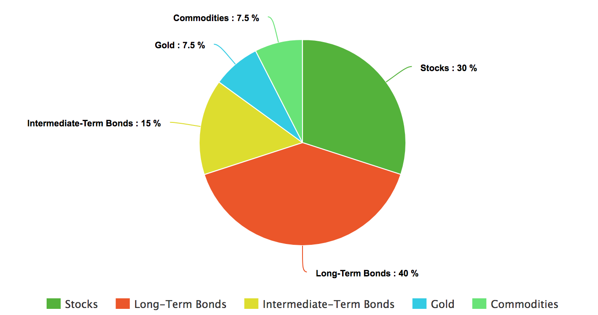
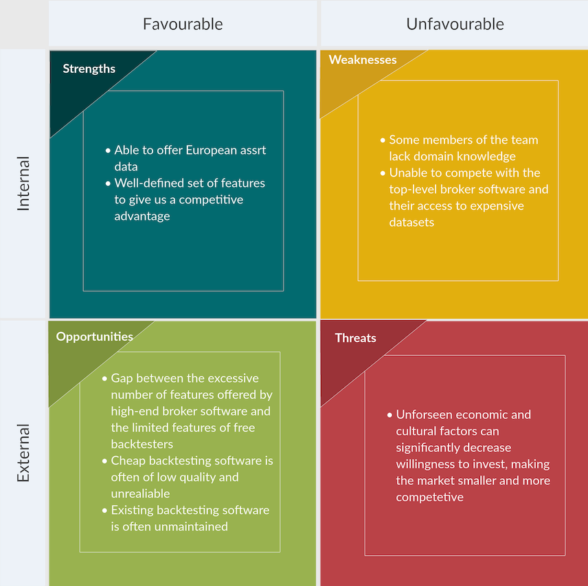
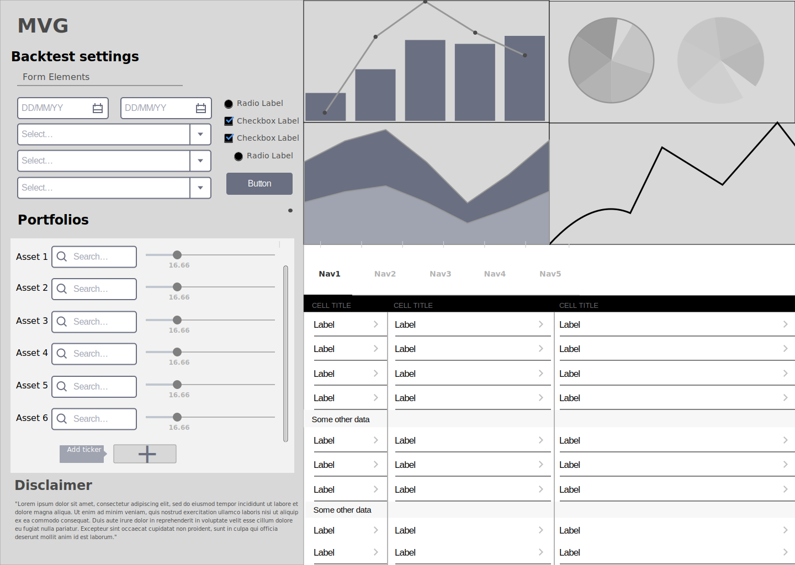
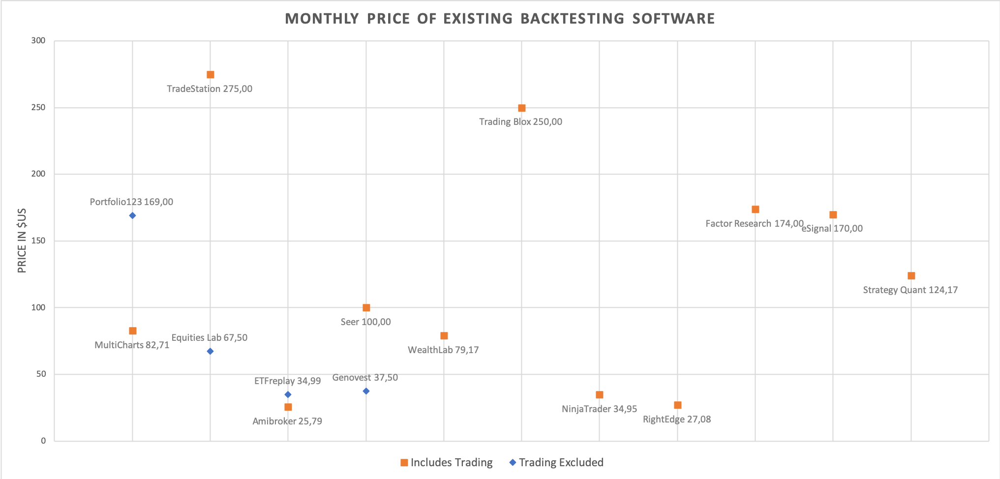

# Vision

## Introduction

Navigating through the world of finance is a daunting task for the average retail investor. While the proliferation of the internet has lowered entry barriers for individuals wishing to take control of their own financial futures, it has also brought with it an onslaught of misinformation often disseminated by sources with dubious interests. Confused and scared of the potential risks of making a wrong decision, one may be tempted to look for professional solutions for wealth management. The reality is, however, that even certified financial analysts often fail to outperform even a simple indexing strategy [1]. Certifications can often be acquired within hours of training even if one has no prior experience with financial markets, and in some cases the very custodians we choose are exposed as scammers or frauds [2]. Add to this exorbitant management charges [3] and it is easy to see why investing their wealth themselves is an appealing choice to an ever increasing number of consumers.

Given the nature of the current investment landscape, the demand within the fintech industry for cheap, reliable and easy-to-use financial tools is greater than ever.

## Problem

To make profitable investing decisions, investors require data. Although by no means a guarantee of future success, a portfolios past performance gives us valuable insight into the risks and rewards associated with an investment. Imagine you’re nearing retirement and can’t afford to sit patiently through another financial crisis waiting for your investments to regain the value that they have lost. Wouldn’t it be useful to consider a variety of portfolios, comparing how much they’ve lost in the worst year out of the last 50? This process is known as backtesting and is usually done with the assistance of a computer. Available backtesting solutions tend to be either too sparse in features for serious financial analysis or too expensive for an individual [Appendix-A].

## Solution

Thalia is an affordable and feature rich backtesting platform that allows investors to assess the viability of investment strategies. With Thalia, you can:

• Specify an asset allocation using hundreds of assets across major asset classes

• Plot the performance of strategies against each other and an index benchmark

• Gain insight into a strategy’s key risk and performance metrics

• Model regular contributions and re-balancing strategies

• Save and share a portfolio to compare and discuss with peers

### Specification of Asset Allocation

Our platform allows you to pick from a wide variety of assets from many of the largest asset classes including Equities, Fixed Income, Currencies, Commodities and Cryptocurrencies. You will be able to design a portfolio using any number of these assets, assigning weights to each one.

### Performance Plots

Once you have specified your asset allocation, you can quickly visualize its performance over any time period, up to the first recordings of price data for your assets. To check whether you are exposing yourself to unnecessary risk, you can pick a variety of common indexing strategies as your performance benchmark. These ‘lazy portfolios’ cover, among others, the S&P 500, a typical 60/40 split of equities and bonds or the ubiquitous ‘All Weather Portfolio’.

### Strategy Insight

Risk and performance metrics are key to assessing the efficacy of an investment strategy over time. Thalia provides you with a dashboard of key figures, on which you will be able to view figures for inflation adjusted annual return, maximum drawdown, worst/best year and many more.

### Regular contributions and rebalancing

Saving is an dynamic process. To see how regular contributions to your initial lump sum affects your portfolio’s performance, you can specify a saving interval and amount. Additionally, to prevent your target allocation from becoming unbalanced due to varying performance, you may also specify a rebalancing strategy, such as quarterly or yearly rebalancing.

### Share your portfolio

Lastly, once you've designed a portfolio you like, you might want to share your results with a colleague or consult with your financial advisor. With Thalia it is a simple matter to save and share your portfolio. We also support exporting a strategy to a human readable format, which you can then print out or save as a PDF file.

# Initial Business Case

## Context Analysis

### Market analysis

First and foremost, let us better understand the market we are about to enter. This is of key importance as 42% of startups fail due to the fact that there is no market for their service [5]. Retail investment is a relatively new, but growing market. In the year 2017 in the U.S. alone 54% of households owned stocks or had some other investment plans [6][7]. Our target audience consists of these individual investors, who instead of seeking the full package that comes with financial advising, would like to take over the wheel, and assess the viability of their investment strategies themselves. In general, retail investors are non-professionals and would like to comparatively invest smaller amounts. Considering that the typical price of a financial advice service for an individual looking to invest around \$50000 (a  pension pot or college fund) is between 1 and 3 percent or \$500 to \$1500 for the one-time creation of a full financial plan, the door is closed to many potential individual investors [8].

### Trend analysis

Let us first consider the macro-environmental factors that can influence the investment sector, using a PEST analysis.

#### Political

Political factors such as regulations and government policies can affect the financial sector. In general, people are more willing to invest in politically stable environments, as political disruptions cause hindrances for most businesses. Consequently, many investment strategies tend to become riskier.

#### Economic

Economic factors are closely intertwined with the stock market. Not only do low levels of income mean that households have no capability to invest, but economic recessions impact large businesses just as much, causing declining revenues and thus indirectly reducing stock prices [9].

#### Social

Cultural factors can also influence investment behaviours, as some people may prefer investing into their own business over financial assets. For example, a financial study showed that less than half of affluent millennials feel confident about investing and retirement planning [10].

#### Technological

Technological advancements offer more and more elaborate means to analyse data and thus more accurate evaluations of a given investment strategy. Additionally, new technological innovations motivate investment as well as boosts the creation of new businesses.

### Competitor analysis

Our competitors are of two types - financial advisors, who offer backtesting as part of their service, and competing software. We have already established that we do not aim to compete with the service provided by financial advisors, as they satisfy another demand altogether. Our main competitors are thus other pieces of software that offer backtesting features.
Some of these are brokers and various third-party trading softwares, such as Fidelity, MetaTrader and NinjaTrader. They are also typically priced highly due to their one-stop-shop nature. Other companies, such as ETFreplay, do not offer trading as a service and solely focus on backtesting. There is a wide range of these as well, when one considers their quality and pricing.
Most companies of both groups decided to commercialise their products based on a monthly/yearly subscription model, but some of them also offer lifetime licenses. For trading software, the price ranges between \$100 and \$300 per month, which can be significantly lowered by a lifetime/yearly subscription. However, for a small retail investor who would not use this software on a daily basis, investing hundreds of dollars into backtesting software is unfeasible.
On the other hand, for a simple backtesting software this range is \$0 - \$200, depending on the quality of the product. Some investors are even willing test their portfolios manually, i.e. with the help of Excel or using a programming language such as Python, R or MATLAB. The widespread use of these methods shows that there is indeed demand for a high-quality, affordable backtesting product.
It is also noteworthy to mention that most backtesting and trading software is US based, and thus has either only a limited number of international asset classes and indices or none at all.
For a comprehensive list of backtesters we have attached a price comparison in Appendix A.

### External factors

Moving on, let us now discuss some external factors. Together with the factors following from an internal analysis of strengths and weaknesses, these can be displayed using the SWOT approach.

## Financial Analysis

### Commercialising our product

Our strategy is to use a subscription-based business model in order to generate a steady flow of revenue. Based on our previous market analysis, we will commercialise our product for a subscription cost of £9.99 per month, or alternatively £99.99 per annum. This would make Thalia one of the most accessible backtesters on the market (see Appendix A). A trial period of 30 days would also be offered upon registering. The trial version of Thalia would include a limited set features while providing all core functionalities.
The trial period is of key importance: retail investors may be reluctant to spend money on a backtesting product when there are others that achieve the same purpose. Allowing them to test our product for free enables them to form a clearer picture of the feature set we provide. Some of our competitors also use trial periods. Risk-averse retail investors would be more willing to try their product than ours if we were to abstain from offering a trial period.

### Financial plan

In order to obtain initial funding, there are two main options. We can seek investment from venture capitalists or apply for a bank loan. Since obtaining a loan of this size for a start-up is quite difficult, we will focus on the former option. According to the National Bureau of Economic Research, a VC can expect a return on investment between 15% and 35%[11]. As we are using a subscription based model, we have identified the customer retention rate as the most important metric in meeting the expectations of potential investors.
Aiming for a 25% retention rate for monthly periods - which is an average rate for media and finance industries [12][13] - would provide us with a steady stream of subscribers. Considering this figure as a benchmark, Thalia will be profitable after 12 – 18 months.

# Technical details

## Overview

Thalia is a website for creating custom portfolios and measuring their performance with different backtesting functions. We have a database of historical asset data that periodically updates itself with daily data from different financial data sources. The backtest results are reported to the users in both graphical and tabular formats.

## Technologies

We use the open-source Python web framework 'Django' to manage our databases and to get a tried and tested web architecture and commonly needed functionalities [14]. We decided on Python and Django for their maturity, prominent use in industry and ease of adoption. This allows us to get to market more quickly.

In addition to static historical data, we need to update our tickers with daily data from different financial trackers. To do this we use several different APIs, some with wrapper libraries and some without, as no single API satisfies all of our data needs. We aim to use mature and free open source libraries for our web application where possible. Howver, for the data gathering layer, we may at times need to use proprietary software or data.

## Architecture

We use the tried and tested three-tier architecture as a base. We augment it with an additional data gathering layer, which periodically updates the internal asset storage with daily data. We make this separation to have a clearer data flow, improve security and increase modularity. The rest of the systems architecture follows the MVT-architecture provided by the Django Framework.

# Appendixes

## Appendix A - Analysis of Competitor Pricing

The following is an analysis of the prices charged by competing backtesting software providers. It is based on a list compiled by a popular financial software price comparison website [4].

# References

[1] [Beating the index](https://us.spindices.com/documents/spiva/spiva-us-year-end-2017.pdf)

[2] [Financial Scams](https://crr.bc.edu/wp-content/uploads/2012/03/Scams-RFTF.pdf)

[3] [The Cost of Fees](https://investor.vanguard.com/investing/how-to-invest/impact-of-costs)

[4] [Price Comparison](https://quantpedia.com/links-tools/)

[5] [SmallBizTrends - Startup Statistics](https://smallbiztrends.com/2019/03/startup-statistics-small-business.html)

[6] [Investopedia - Retail Investor Definition](https://www.investopedia.com/terms/r/retailinvestor.asp)

[7] [Gallup - U.S. Stock Ownership Down Among All but Older, Higher-Income](https://news.gallup.com/poll/211052/stock-ownership-down-among-older-higher-income.aspx) (This might be a problem)

[8] [Advisory HQ](https://www.advisoryhq.com/articles/financial-advisor-fees-wealth-managers-planners-and-fee-only-advisors/)

[9] [Bucher-Koenen, Tabea and Ziegelmeyer, Michael Heinrich, Who Lost the Most? Financial Literacy, Cognitive Abilities, and the Financial Crisis - ECB Working Paper No. 1299.](https://papers.ssrn.com/sol3/papers.cfm?abstract_id=1761512)

[10] [Investopedia - The Affluent Millennial Investing Survey](https://www.investopedia.com/the-investopedia-affluent-millennials-study-4769751)

[11] [National Bureau of Economic Research: How High are VC Returns?](https://www.nber.org/digest/may01/w8066.html)

[12] [Sophia Bernazzani - Customer Retention](https://blog.hubspot.com/service/customer-retention)

[13] [Society For Human Resource Management](https://www.shrm.org/hr-today/trends-for theirand-forecasting/research-and-surveys/Documents/2017-Human-Capital-Benchmarking.pdf)

[14] [Django]([https://www.djangoproject.com/](https://www.djangoproject.com/)

