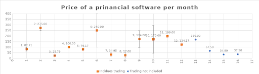

# Appendix A - Analysis of Competitor Pricing

The following is an analysis of pricing schemes of major competing backtesting software based on list compiled by popular financial comparison website [1]. Data is based off all pricing tiers available on a specific platform. Pricing can vary if it is offered at different feature tiers or if different lengths of subscriptions are offered (for example buying membership for one or two years in advanced generally gives a discounted price).

Refs:
Data was collected 8.11.2019
[1]https://quantpedia.com/links-tools/
