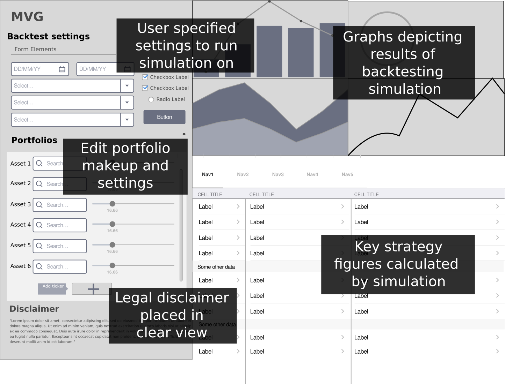

# Technical details

## Overview

Thalia is a website for creating custom portfolios and measuring their performance with different backtesting functions. We have a database of historical asset data that periodically updates itself with daily data from different financial data sources. The backtesting results are reported to the users in both graphical and tabular formats.

## Technologies

We use the open-source Python web framework 'Django' to manage our databases and to get a tried and
tested web architecture and commonly needed functionalities. We decided on Python and Django for their
maturity, prominent use in industry and ease of adoption, so we can quickly get to market.

In addition to static historical data, we need to update our tickers with daily data from different
financial trackers. To do this we use several different APIs, some with wrapper libraries and some without,
as no single API satisfies all our data needs. We aim to use mature and free open source libraries for
our web application where possible but for the data gathering layer, we may at times need to use proprietary
software or data, as not all API wrapper libraries and asset price data sets are openly available. Our team is commited to continue vetting each of our sources to assure they are reputable and reliable. We will also aim to increase the number of these going further to provide redundancy in the case that issues should arise regarding any of these.

## Architecture

We use the tried and tested three-tier architecture as a base with an additional data gathering layer,
which periodically updates the internal asset storage with daily data as it becomes available. We make this separation to have
a clearer data flow, improve security and increase modularity. It also allows us to make easily make changes related to specific asset sources as we can modify the code that updates and tracks each seperatly. This helps to mittigate the harms that would generally be associated with gathering data from different places. Specifically, it allows us to add/remove/modify data sources without having to interfere with the rest of the application. The rest of the systems architecture follows
the MVT-architecture provided by the Django Framework.

