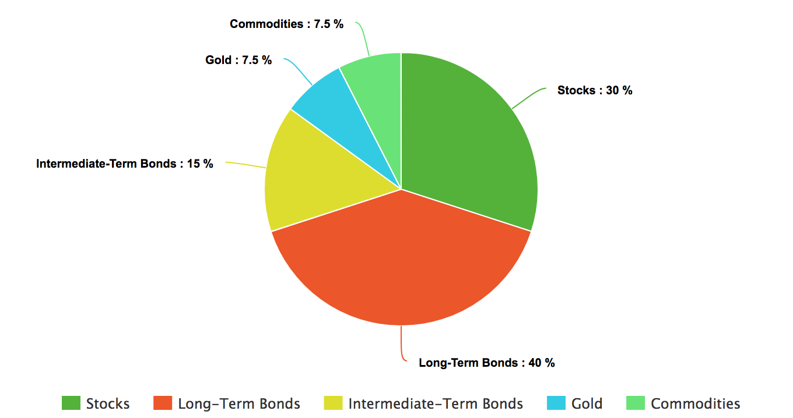

# Vision

## Introduction
Navigating through the world of finance is a daunting task for the average retail investor. While the proliferation of the internet has lowered entry barriers for individuals wishing to take control of their own financial futures, it has also brought with it an onslaught of misinformation often disseminated by sources with dubious interests. Confused and scared of the potential risks of making a wrong decision, one may be tempted to look for professional solutions for managing their wealth. The reality is, however, that even certified financial analysts often fail to outperform even a simple indexing strategy [1]. Certifications can often be acquired within hours of training even if one has no prior experience with financial markets, and in some cases the very custodians we choose are exposed as scammers or frauds [2]. Add to this exorbitant management charges [3] and it is easy to see why investing their wealth themselves is an appealing choice to a lot of consumers.

Given the nature of the current investment landscape, the demand within the fintech industry for cheap, reliable and easy-to-use financial tools is greater than ever.

## Problem

To make profitable investing decisions, investors require data. Although by no means a guarantee of future success, a portfolios past performance gives us valuable insight into the risks and rewards associated with an investment. Imagine you’re nearing retirement and can’t afford to sit patiently through another financial crisis waiting for your investments to regain the value that they have lost. Wouldn’t it be useful to consider a variety of portfolios, comparing how much they’ve lost in the worst year out of the last 50? This process is known as backtesting [a1] and is usually done with the assistance of a computer. Currently available backtesting solutions tend to be either too sparse in features for serious financial analysis or too expensive for an individual without the backing of a large institution to afford [a2].

## Solution

Thalia is an affordable and feature rich backtesting platform that allows investors to assess the viability of investment strategies. With Thalia, you can:
 • Specify an asset allocation using hundreds of assets across major asset classes
 • Plot the performance of strategies against each other and an index benchmark
 • Gain insight into a strategy’s key risk and performance metrics
 • Model regular contributions and re-balancing strategies
 • Save and share a portfolio to compare and discuss with peers

### Specification of Asset Allocation

Our platform allows you to pick from a wide variety of assets from commonly invested asset classes including but not limited to Equities, Fixed Income, Currencies, Commodities and Cryptocurrencies. You will be able to design a portfolio using any number of these assets, assigning weights to each one.

### Performance Plots

Once you have specified your asset allocation, you can quickly visualize its performance over any time period, up to the first recordings of price data for your assets. To check whether you are exposing yourself to unnecessary risk, you can pick a variety of common indexing strategies as your performance benchmark. These ‘lazy portfolios’ cover, among others, the S&P 500, a typical 60/40 split of equities and bonds or the ubiquitous ‘All Weather Portfolio’.

### Strategy Insight

Risk and performance metrics are key to assessing the efficacy of an investment strategy over time. Thalia provides you with a dashboard of key figures, on which you will be able to view figures for inflation adjusted annual return, maximum drawdown, worst/best year and many more.

### Regular contributions and rebalancing

Saving is an dynamic process. To see how regular contributions to your initial lump sum affects your portfolio’s performance, you can specify a saving interval and amount. Additionally, to prevent your target allocation from becoming unbalanced due to varying performance, you may also specify a re balancing strategy, such as quarterly or yearly rebalancing.

### Share your portfolio

Lastly, once you've designed a portfolio you like, you might want to share your results with a colleague or consult with your financial advisor. With Thalia it is a simple matter to save and share your portfolio. We also support exporting a strategy to a human readable format, which you can then print out and save as a PDF file.

[1] [https://us.spindices.com/documents/spiva/spiva-us-year-end-2017.pdf](https://us.spindices.com/documents/spiva/spiva-us-year-end-2017.pdf)

[2]
[https://www.esma.europa.eu/sites/default/files/library/esma50-165-731-asr-performance_and_costs_of_retail_investments_products_in_the_eu.pdf]
[https://crr.bc.edu/wp-content/uploads/2012/03/Scams-RFTF.pdf](https://crr.bc.edu/wp-content/uploads/2012/03/Scams-RFTF.pdf)

[3]
[https://investor.vanguard.com/investing/how-to-invest/impact-of-costs](https://investor.vanguard.com/investing/how-to-invest/impact-of-costs)

[4]
[https://www.world-exchanges.org/storage/app/media/research/Studies_Reports/WFE%20Enhancing%20Emerging%20Market%20Retail%20Trading%20Report%20-%203%20August%202017.pdf](https://www.world-exchanges.org/storage/app/media/research/Studies_Reports/WFE%20Enhancing%20Emerging%20Market%20Retail%20Trading%20Report%20-%203%20August%202017.pdf)

[5]
[https://www.ecb.europa.eu/paym/groups/pdf/fxcg/111005_FX_retail_trading.pdf]

[a1] https://en.wikipedia.org/wiki/Backtesting

[a2] Appendix: ./CompetitorComparison.md
